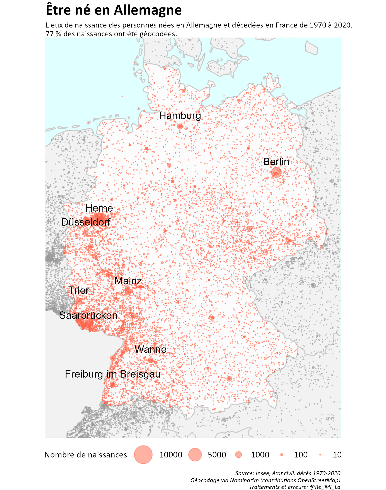
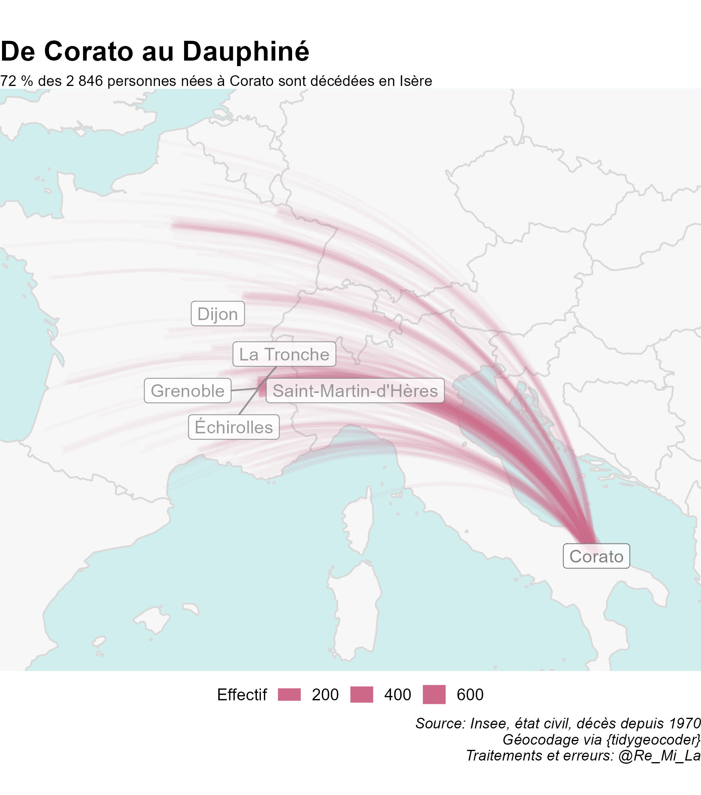
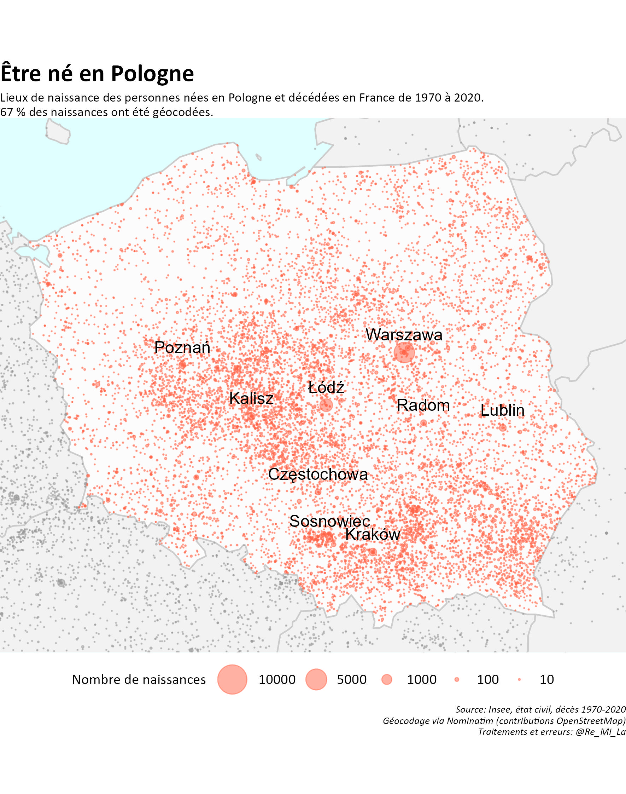

```{r setup, include=FALSE}
knitr::opts_chunk$set(echo = TRUE)
library(plotly)
library(tidyverse)
library(sf)
library(kableExtra)
library(extrafont)
loadfonts(device = "win")

```

# Quelles migrations ?

Lorsqu'une personne décède, ses dates et lieux de naissances sont mentionnés dans l'acte de décès. Les fichiers nominatifs d'actes de décès sont diffusés par l'Insee pour tous les événements survenus depuis 1970 ([ici](<https://www.insee.fr/fr/information/4769950>)). L'analyse des lieux de naissance permet donc l'étude, partielle, de certaines migrations internationales.

### Migrations et non immigration

Etude partielle à plusieurs titres. D'une part, **il s'agit bien ici de migration et non d'immigration** au sens statistique du terme. Dans la statistique française, du fait du passé colonial du pays, un.e immigré.e est "une personne née *étrangère* à l'étranger". Ainsi, les personnes nées françaises en Algérie ne sont pas des immigrées ([plus d'infos](<https://www.insee.fr/fr/statistiques/fichier/2416930/insee-en-bref-immigration.pdf>)).

### La fragile chronologie des mouvements de population

Etude partielle également car **la chronologie exacte des migrations est impossible à reconstituer** à partir des seuls éléments d'état civil. Les graphiques qui suivent sont présentés aux 25 ans des personnes : l'évolution des effectifs annuels moyens ainsi présentés semble coïncider avec des événements historiques (début et fin de la deuxième guerre mondiale notamment). Ainsi en Autriche, les migrations sont au plus haut pour les personnes ayant 25 ans vers 1945, et le second pic vers 1970 peut correspondre aux enfants de cette génération, nés en Autriche mais ayant migré avec leurs parents dès leur plus jeunes âge. Pour l'Espagne, le pic des effectifs est atteint pour la génération entrée dans l'âge adulte au cours des années 1930 (et donc de la guerre civile). Au Maroc, c'est la fin du protectorat (1956) qui a pu entraîner des départs importants de population. Enfin, en Pologne, les générations de jeunes adultes ont migré soit dans les années 1930, beaucoup moins pendant la guerre, puis enfin après la guerre, durant les premières années de la république populaire.


```{r chronologies1, out.width = "100%", fig.align = "center", echo=FALSE}
chronologies <- readRDS("donnees/historique.RDS") %>% 
  filter(PAYSOK %in% c("POLOGNE","ESPAGNE","MAROC","AUTRICHE")) %>% 
  mutate(annee25=as.integer(ANAIS)+25,
         geocodage=as.factor(if_else(is.na(display_name),"0","1"))) %>%
  count(PAYSOK,annee25,geocodage,wt=n.x) %>% 
  filter(annee25>1800 & annee25<2025) %>% 
  ggplot(aes(x=annee25,y=n,group=geocodage))+
  geom_line(aes(color=geocodage),size=1,alpha=.7) +
  facet_wrap(~PAYSOK,scales = "free_y")+
  annotate("rect", xmin=1900, xmax=1930, ymin=0, ymax=Inf, alpha=0.2, fill="gray80",color=NA)+ 
  annotate("rect", xmin=1960, xmax=2000, ymin=0, ymax=Inf, alpha=0.2, fill="gray80",color=NA)+ 
  scale_color_manual(name="Géocodage",
                     labels=c("0"="Echec","1"="Réussite"),
                     values=c("0"="coral2","1"="darkolivegreen3"))+
  scale_x_continuous(breaks = c(1900,1920,1930,1940,1950,1960,1980,2000),
                     limits = c(1900,2000))+
  labs(title = "",
       subtitle="",
       x="Année des 25 ans",
       y="Effectif",
       caption="")+
  theme_minimal()+
  theme(legend.position = "bottom",
        text = element_text(size=10,family = "Calibri"),
        plot.title = element_text(face="bold",size=14),
        plot.subtitle = element_text(size=10),
        plot.caption = element_text(face = "italic",size=6),
        legend.title = element_text(size=8),
        legend.text = element_text(size=8)
  )
ggplotly(chronologies) %>% 
  layout(title = list(text = paste0("Venus d'Autriche, d'Espagne, du Maroc ou de Pologne, ils avaient 25 ans en ...",
                                    '<br>',
                                    '<sup>',
                                    "Nombre de personnes nées dans l\'un de ces pays et décédées en France de 1970 à 2020,selon l\'année de leur 25 ans et la qualité du géocodage.",
                                    '</sup>')),
         annotations = 
           list(x = 1, y = -1, text = "Source: Insee, état civil, décès 1970-2020\nGéocodage via Nominatim (contributions OpenStreetMap)\nTraitements et erreurs: @Re_Mi_La", 
                showarrow = F, xref='paper', yref='paper', 
                xanchor='right', yanchor='auto', xshift=0, yshift=0,
                font=list(size=10, color="black")))

```


L'étude de l'âge moyen au décès selon l'année des 25 ans suggère enfin que la période pour laquelle ces données sont fiables court de 1930 à 1950. Pour les générations ayant 25 avant 1930, l'âge moyen au décès est très élevé, indiquant ainsi que seuls les décès tardifs sont recensés. Au-delà de 1950, l'âge moyen, au décès est très faible, indiquant au contraire que ces décès sont majoritairement prématurés.

```{r chronologies2, out.height="30%", out.width = "30%", fig.align = "center", echo=FALSE}


agemoy <- readRDS("donnees/base_age.RDS") %>% 
  ggplot()+
  geom_line(aes(x=annee25,y=agemoy,group=1),color="firebrick1",size=1)+
  labs(x="Année des 25 ans",
       y="Âge moyen au décès")+
  theme_minimal()+
  theme(axis.text.x = element_text(angle=90))

ggplotly(agemoy)

```

### Noms de lieux : les noms

Etude partielle enfin car **le défi était ici de géocoder les lieux de naissance à l'étranger**. Lieux de naissances dans une langue voire un alphabet souvent autre que le français (ou alors francisés), inscrits une première fois à la main et parfois avec des erreurs par un officier d'état civil puis saisis, avec les mêmes risques, dans les fichiers informatisés de l'Insee. Par ailleurs, au fil des années, les découpages géographiques ont évolué, que ce soit les frontières des pays, les contours des communes, leur statut administratif ou leur dénomination. Autant dire que l'exercice est périlleux.

```{r graphies, out.width = "80%", fig.align = "center", echo=FALSE}
#

exemple <- readRDS("donnees/osm_PAYSBAS2.RDS") %>% 
  filter(str_detect(display_name,"Haag")) %>% 
  select(PAYSOK,COMMOK,n,display_name)

knitr::kable(exemple,
             caption = "La Haye : 40 écritures pour une seule ville",
             table.attr = "class=\"striped\"") %>% 
  kable_styling("striped", full_width = F) %>% 
  scroll_box(width = "1000px", height = "200px")
```

Périlleux mais pas impossible et surtout très instructif. Se mêlent ainsi les grandes lignes de l'histoire de l'immigration en France : migrations de proximité, conséquences de la colonisations et mouvements massifs très localisés.

préciser que je ne parle que d'Europe
graphique des décès par années selon lieu de naissance étranger ou autre


# Être né quelque part, dans l'espace européen et méditerranéen

combien ?
quels premiers pays?

```{r carte_europe, out.width = "80%", fig.align = "center", echo=FALSE}
knitr::include_graphics("sorties/europe2.jpeg")
```


### Les migrants, nos proches voisins

Dans tous les pays limitrophes de la métropole, les migrations de proximité sont surreprésentées. Cela résulte à la fois du principe même de frontière qui peut jouer le rôle d'interface mais aussi du dynamisme particulier que connaissent les territoires proches du couloir rhénan.

En Allemagne, les personnes nées à moins de 25 km de la frontière française représentent 19 % des migrants quand cette portion du territoire représente moins de 3 % du pays. Pour la Belgique, cette même bande limitrophe représente 30 % du territoire et a vu naître 42 % des migrants. 

Ce phénomène, amoindri par les barrières physiques sur lesquelles sont assises certaines frontières, reste néanmoins visible en Italie, en Espagne et au Royaume-Uni  : 5 % des migrants italiens sont nés sur 3 % du territoire, 6 % des espagnols sur 2 % du territoire et 52 % des britanniques sur 19 % du territoire (seuil à 200 km dans ce cas, incluant Londres dans ce cas).

Au Luxembourg et en Suisse, la France n'est jamais bien loin. Et pourtant le constat est identique : 66 % des nés en Suisse et 85 % des nés au Luxembourg sont originaires d'une commune à moins de 25 km de la frontière (soit, respectivement, 19 % et 42 % du territoire).

```{r interface, out.width = "100%", fig.align = "center", echo=FALSE}
proximite <- readRDS("donnees/proximite.RDS")

proximite %>% 
  mutate(plus=100-pct200,
         pct200=pct200-pct100,
         pct100=pct100-pct50,
         pct50=pct50-pct25) %>% 
  mutate(pct25=if_else(is.na(pct25),0,pct25),
         pct50=if_else(is.na(pct50),0,pct50)) %>% 
  pivot_longer(cols=c("pct25","pct50","pct100","pct200","plus"),
               names_to="seuil",
               values_to="part") %>% 
  mutate(seuil=fct_relevel(seuil,c("pct25","pct50","pct100","pct200","plus")),
         PAYSOK=str_to_title(PAYSOK)) %>% 
  ggplot( aes(fill=seuil, values=part)) +
  waffle::geom_waffle(color = "white", size=1.125, n_rows = 10, 
                      make_proportional = TRUE) +
  scale_fill_manual(name="Commune de naissance à moins de ...\nde la frontière française",
                    labels=c("pct25"="25 km",
                             "pct50"="50 km",
                             "pct100"="100 km",
                             "pct200"="200 km",
                             "plus"="Plus"),
                    values=c("pct25"="coral4",
                             "pct50"="coral3",
                             "pct100"="coral2",
                             "pct200"="coral1",
                             "plus"="gray80"))+
  facet_wrap(~PAYSOK) +
  scale_x_discrete(expand=c(0,0)) +
  scale_y_discrete(expand=c(0,0)) +
  coord_equal()
```

### Quitter les grandes villes

Autre cas, celui des pays, notamment d'Europe centrale et orientale, pour lesquels la majorité des naissances ont eu lieu dans les grandes villes voire seulement la capitale. Par exemple : .

# Petite histoire et grands mouvements

### Herne, Corato et Sommatino

Lorsqu'on affiche les principales villes d'origine (de naissance), la lecture des cartes révèle quelques surprises. Ainsi, les villes d'Herne en Allemagne, de Corato et Sommatino en Italie.
```{r micro, out.width = "60%", fig.align = "center", echo=FALSE}

knitr::include_graphics("sorties/ITALIE2.jpeg")
knitr::include_graphics("sorties/herne.jpg")
knitr::include_graphics("sorties/sommatino.jpg")


```

### Italiens d'Isère et Westphaliens du Nord-Pas-de-Calais

# Migrations polonaises : les frontières comme limites

Le géocodage se fait sur deux attributs : le nom de pays et le nom de la commune. Dans le cas de la Pologne, cette méthode semble clairement induire un biais. A l'oeil nu, on voit ainsi se dessiner sur la carte l'ancienne frontière occidentale du pays, lorsque des villes commme Szczeczin (Stettin), Głogów (Glogau) et Wrocław (Breslau) étaient allemandes.

```{r pologne, out.width = "60%", fig.align = "center", echo=FALSE}

```