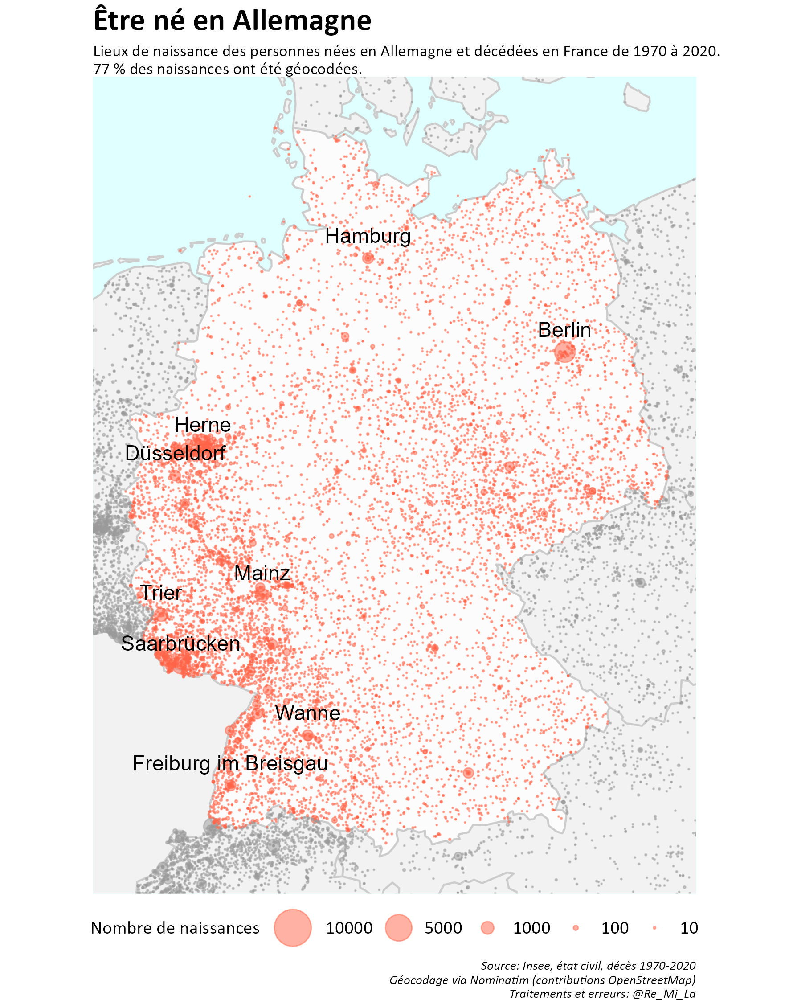
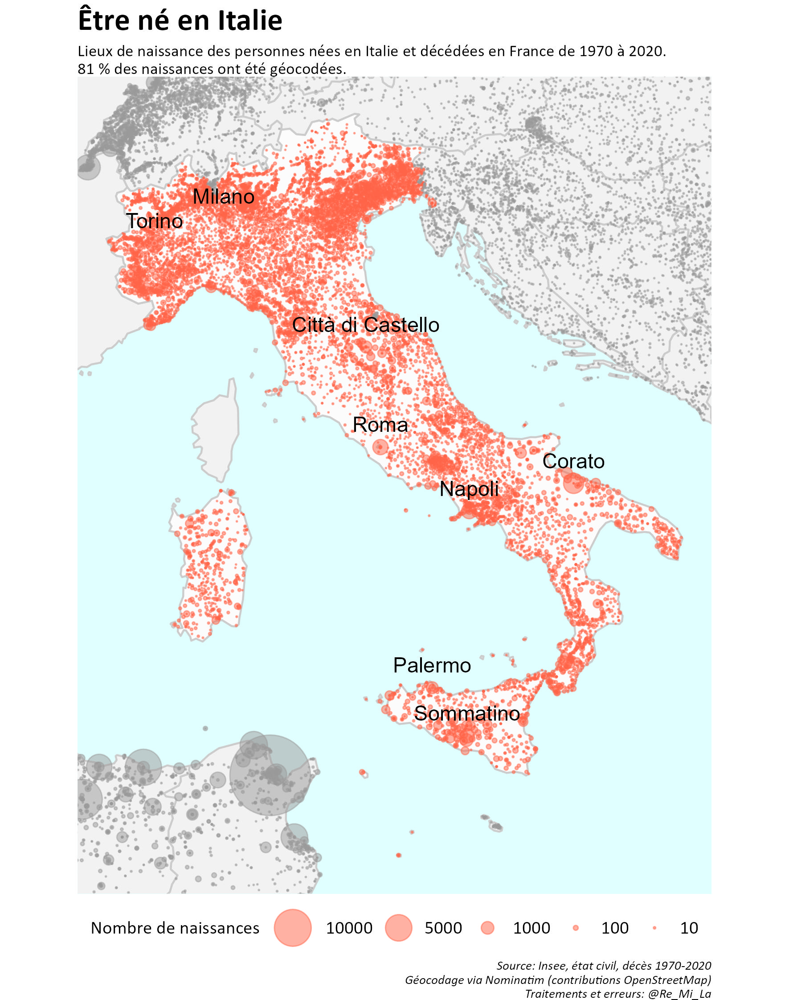
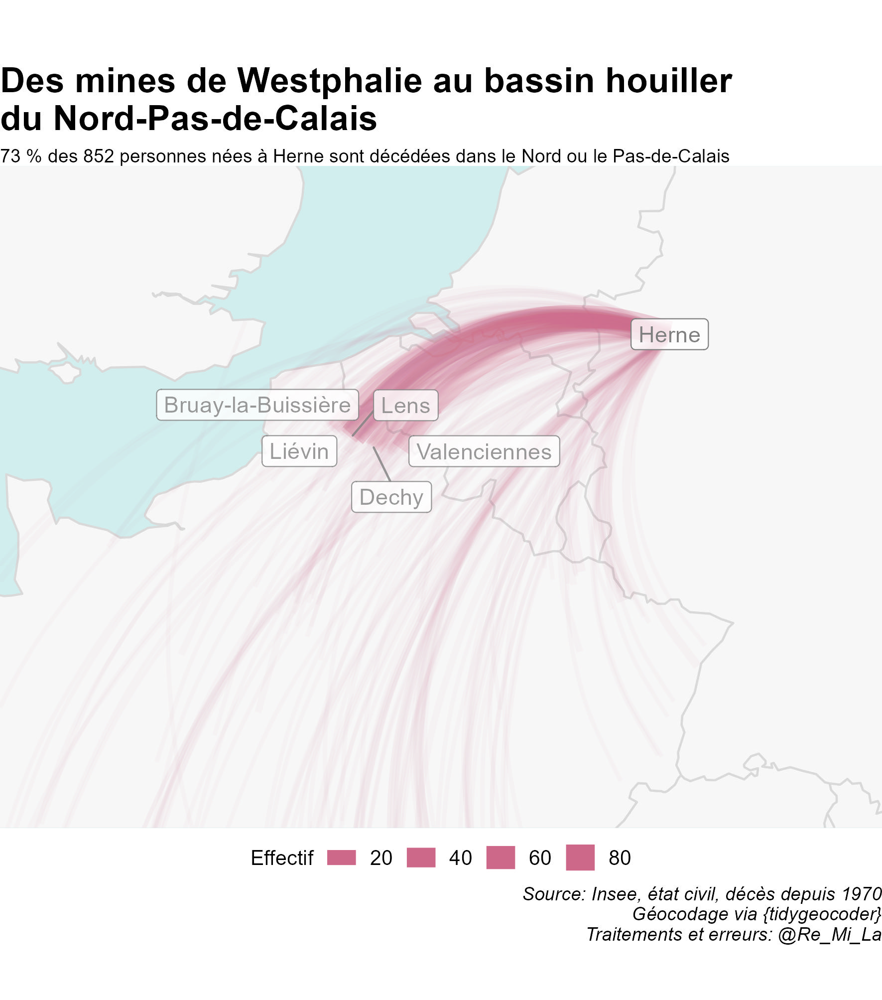
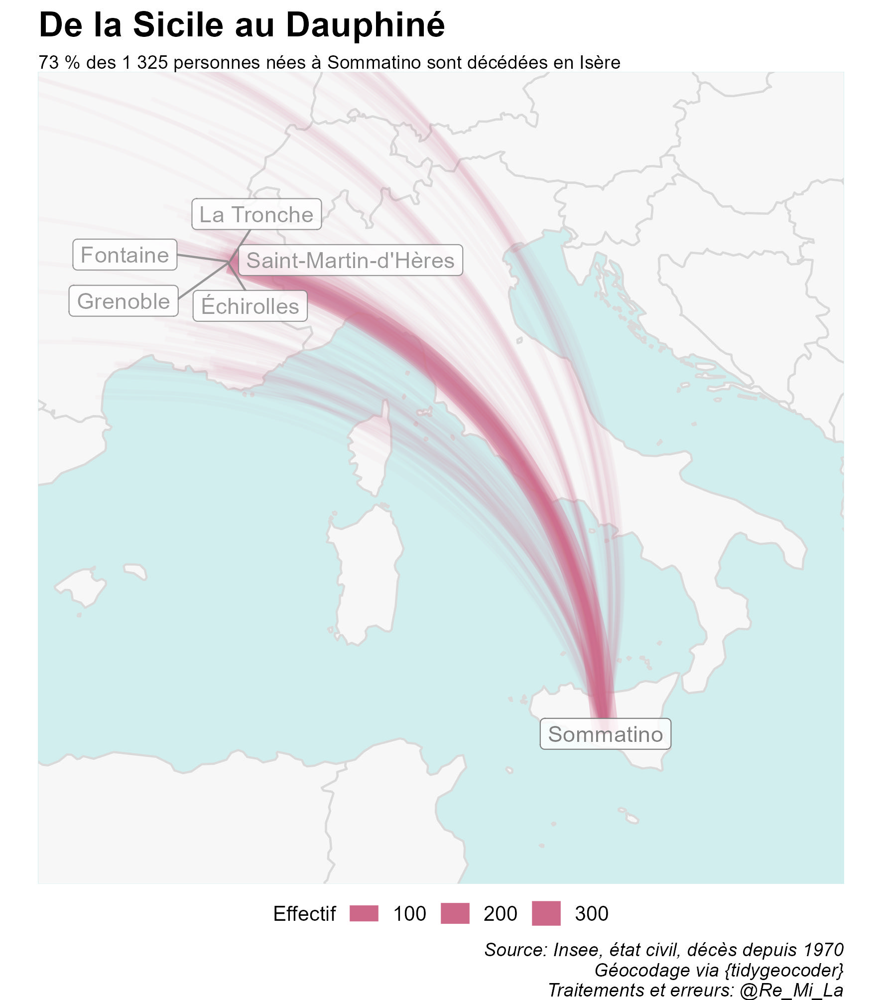
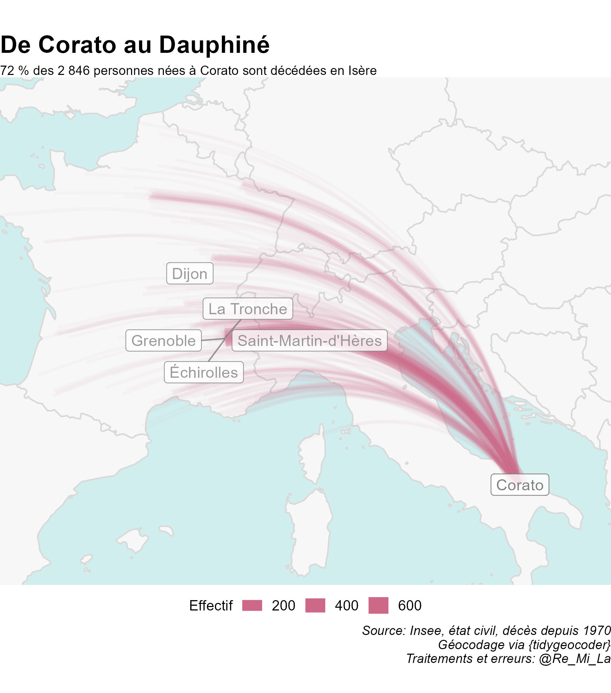
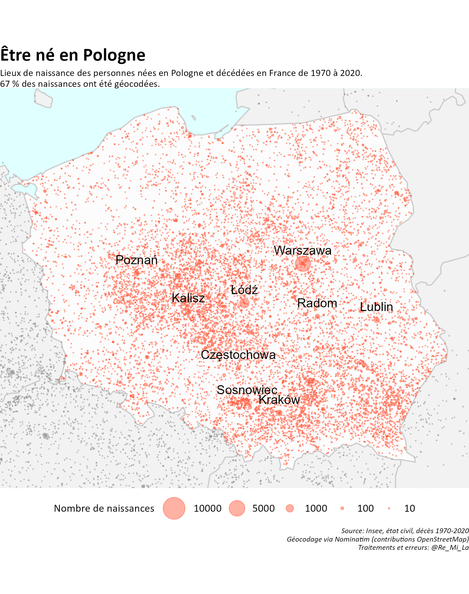

Quelles migrations ?
====================

Lorsqu’une personne décède, ses dates et lieux de naissances sont
mentionnés dans l’acte de décès. Les fichiers nominatifs d’actes de
décès sont diffusés par l’Insee pour tous les événements survenus depuis
1970 ([ici](https://www.insee.fr/fr/information/4769950)). L’analyse des
lieux de naissance permet donc l’étude, partielle, de certaines
migrations internationales.

### Migrations et non immigration

Etude partielle à plusieurs titres. D’une part, **il s’agit bien ici de
migration et non d’immigration** au sens statistique du terme. Dans la
statistique française, du fait du passé colonial du pays, un.e immigré.e
est “une personne née *étrangère* à l’étranger”. Ainsi, les personnes
nées françaises en Algérie ne sont pas des immigrées ([plus
d’infos](https://www.insee.fr/fr/statistiques/fichier/2416930/insee-en-bref-immigration.pdf)).

### La fragile chronologie des mouvements de population

Etude partielle également car **la chronologie exacte des migrations est
impossible à reconstituer** à partir des seuls éléments d’état civil.
Les graphiques qui suivent sont présentés aux 25 ans des personnes :
l’évolution des effectifs annuels moyens ainsi présentés semble
coïncider avec des événements historiques (début et fin de la deuxième
guerre mondiale notamment). Ainsi en Autriche, les migrations sont au
plus haut pour les personnes ayant 25 ans vers 1945, et le second pic
vers 1970 peut correspondre aux enfants de cette génération, nés en
Autriche mais ayant migré avec leurs parents dès leur plus jeunes âge.
Pour l’Espagne, le pic des effectifs est atteint pour la génération
entrée dans l’âge adulte au cours des années 1930 (et donc de la guerre
civile). Au Maroc, c’est la fin du protectorat (1956) qui a pu entraîner
des départs importants de population. Enfin, en Pologne, les générations
de jeunes adultes ont migré soit dans les années 1930, beaucoup moins
pendant la guerre, puis enfin après la guerre, durant les premières
années de la république populaire.

L’étude de l’âge moyen au décès selon l’année des 25 ans suggère enfin
que la période pour laquelle ces données sont fiables court de 1930 à
1950. Pour les générations ayant 25 avant 1930, l’âge moyen au décès est
très élevé, indiquant ainsi que seuls les décès tardifs sont recensés.
Au-delà de 1950, l’âge moyen, au décès est très faible, indiquant au
contraire que ces décès sont majoritairement prématurés.

[ajouter graph age moyen au deces]

### Noms de lieux : les noms

Etude partielle enfin car **le défi était ici de géocoder les lieux de
naissance à l’étranger**. Lieux de naissances dans une langue voire un
alphabet souvent autre que le français (ou alors francisés), inscrits
une première fois à la main et parfois avec des erreurs par un officier
d’état civil puis saisis, avec les mêmes risques, dans les fichiers
informatisés de l’Insee. Par ailleurs, au fil des années, les découpages
géographiques ont évolué, que ce soit les frontières des pays, les
contours des communes, leur statut administratif ou leur dénomination.
Autant dire que l’exercice est périlleux.

Périlleux mais pas impossible et surtout très instructif. Se mêlent
ainsi les grandes lignes de l’histoire de l’immigration en France :
migrations de proximité, conséquences de la colonisations et mouvements
très localisés.

Être né quelque part, dans l’espace européen et méditerranéen
=============================================================

### Les migrants, nos proches voisins

Dans tous les pays limitrophes de la métropole, les migrations de
proximité sont surreprésentées. Cela résulte à la fois du principe même
de frontière qui peut jouer le rôle d’interface mais aussi du dynamisme
particulier que connaissent les territoires proches du couloir rhénan.

En Allemagne, les personnes nées à moins de 25 km de la frontière
française représentent 19 % des migrants quand cette portion du
territoire représente moins de 3 % du pays. Pour la Belgique, cette même
bande limitrophe représente 30 % du territoire et a vu naître 42 % des
migrants.

Ce phénomène, amoindri par les barrières physiques sur lesquelles sont
assises certaines frontières, reste néanmoins visible en Italie, en
Espagne et au Royaume-Uni : 5 % des migrants italiens sont nés sur 3 %
du territoire, 6 % des espagnols sur 2 % du territoire et 52 % des
britanniques sur 19 % du territoire (seuil à 200 km dans ce cas,
incluant Londres).

Au Luxembourg et en Suisse, la France n’est jamais bien loin. Et
pourtant le constat est identique : 66 % des nés en Suisse et 85 % des
nés au Luxembourg sont originaires d’une commune à moins de 25 km de la
frontière (soit, respectivement, 19 % et 42 % du territoire).

[graph proximité]

### Quitter les grandes villes

Autre cas, celui des pays, notamment d’Europe centrale et orientale,
pour lesquels la majorité des naissances ont eu lieu dans les grandes
villes voire seulement la capitale. Par exemple : .

Petite histoire et grands mouvements
====================================

### Herne, Corato et Sommatino

Lorsqu’on affiche les principales villes d’origine (de naissance), la
lecture des cartes révèle quelques surprises. Ainsi, les villes d’Herne
en Allemagne, de Corato et Sommatino en Italie.

### Italiens d’Isère et Westphaliens du Nord-Pas-de-Calais

Migrations polonaises : les frontières comme limites
====================================================

Le géocodage se fait sur deux attributs : le nom de pays et le nom de la
commune. Dans le cas de la Pologne, cette méthode semble clairement
induire un biais. A l’oeil nu, on voit ainsi se dessiner sur la carte
l’ancienne frontière occidentale du pays, lorsque des villes commme
Szczeczin (Stettin), Głogów (Glogau) et Wrocław (Breslau) étaient
allemandes.

